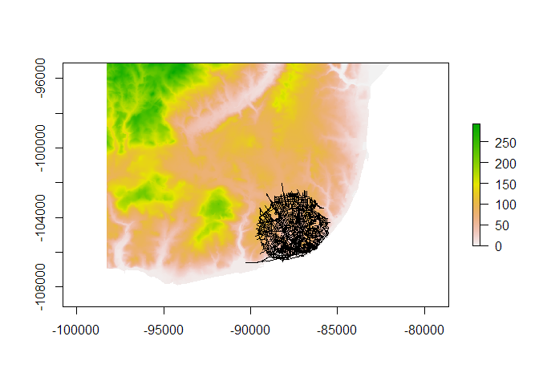
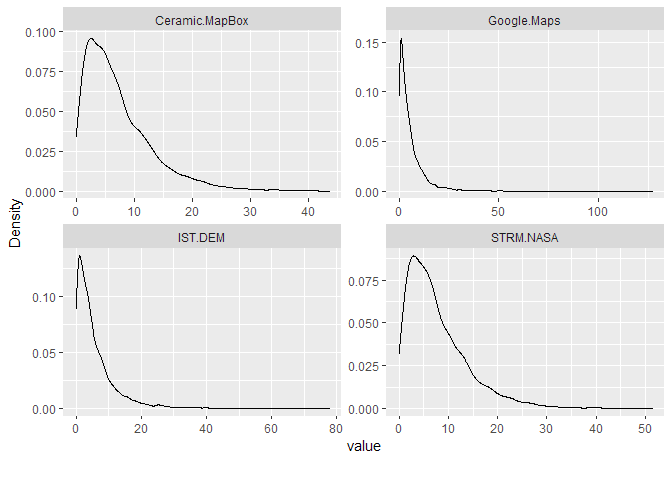
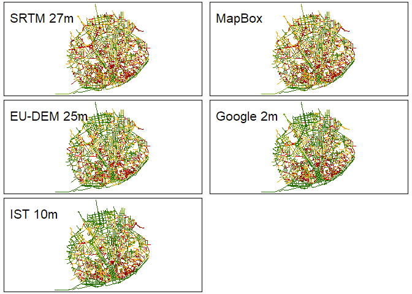

Benchmark Elevation Sources to assess gradient for active transportation
================

## Introduction

Different elevation sources may bring better or worse results, when
computing slopes for a road network.  
In many cases, the resolution of raster digital elevation models (DEM)
does not matter much, when we assume that they will be small enough for
large segments - for instance, if we need to know the gradient of a 2km
length highway, planned for motorized vehicles.  
But when physical effort matters, such as for active travel (walking,
cycling), a 50m road with a 2% gradient might be very different from an
8% gradient.  
For smaller road segments, getting an accurate gradient value might be
an issue, in particular when the free and open data sources do not
provide a good resolution.  
In this example, we will see and compare the results of [slopes R
package](https://github.com/ITSLeeds/slopes) for the same road network
sample (in Lisbon, Portugal), using **five** different elevation data
sources, with different resolution.

## Literature

In active modes of transportation, such as walking or cycling, movement
occurs along a network of elements that set up the pedestrian or the
cycling infrastructure. Modelling such networks plays an important role
in the planning of transportation, and the related policy design. Thus,
spatial data on the natural and built environment is essential to
effectively estimate the generic costs or efforts involved in active
modes. Topography is a key component of the environment with impact on
the physical effort of active travel modes: [Rodrı́guez and
Joo](#ref-Rodriguez2004) ([2004](#ref-Rodriguez2004)) explored the
direct relation between topography and people’s propensity to walk or
cycle. As such, to effectively reflect active transportation effort,
transportation planning analysis for active modes must take into account
a generalized cost of travel reflecting the topography. Slope, the key
derived data from topography that most impacts active transportation,
has been demonstrated to be one of the factors that bicyclists are
sensitive to when deciding on paths ([Broach, Dill, and Gliebe
2012](#ref-Broach2012)). [Iseki and Tingstrom](#ref-Iseki2014)
([2014](#ref-Iseki2014)) have examined the extent to which topography
influences the determination of bikesheds, while
[Macias](#ref-Macias2016) ([2016](#ref-Macias2016)) explored methods for
the calculation of pedestrian catchment areas for public transit
incorporating topography data and energy expenditure estimates. Despite
its importance, topography, and its derived slope quantification, has
been identified as a major data limitation in many studies concerning
active accessibility in active modes ([Vale, Saraiva, and Pereira
2016](#ref-Vale2016)). Slope can be estimated using elevation data
sources at various scales and obtained using distinct techniques. Slope
itself can be calculated using several formulae and algorithms,
especially for grid digital elevation models (DEM) ([J. Tang and Pilesjö
2011](#ref-Tang2011); [Jing Tang, Pilesjö, and Persson
2013](#ref-Tang2013)), but for the case of the linear segments of a
transportation network, longitudinal slope is to be assigned.

-   Mostrar exemplos de route planners (quantos/que %) usa o declive? E
    como é que este é obtido?
-   Mostrar as fontes (texto abaixo, RF)

Google Maps Terrain is improving every year ([Harris
2014](#ref-Harris2014); [El-Ashmawy 2016](#ref-Egypt2016); [Wang
2017](#ref-Wang2017)). It started by using SRTM data, but now at some
places, it recurs to LIDAR technology ([Scott 2010](#ref-Scott2010)),
although not available yet for all places (see:
<https://en.wikipedia.org/wiki/National_lidar_dataset>). It requires an
API key for [elevation
access](https://developers.google.com/maps/documentation/elevation/overview).

[OpenTopoData](https://www.opentopodata.org/#public-api) provides a nice
comparison of the available topographic data, regarding its resolution
and coverage. Unfortunately, the open ones, with a good resolution, only
cover USA and New Zeland.

### How are slopes computed using DEMs?

Is their quality, resolution, etc. enough to approximate the reality?

In open datasets, they don’t always say how the slope was computed of
which information was used as base.

### The scaling problem of geographic information for active modes (streets)

## Materials - Data sources

Open data sources.  
Road Network: OpenstreetMap…

### For Elevation Models

For this example, we will use and compare four elevation sources:

-   NASA Digital Elevation Model, with 27m cell resolution
-   MapBox-Terrain tiles, with 0.1 meter height increments (ref)
-   Google Elevation, with resolution of 1.9m
-   Copernicus European DEM, with 25m cell resolution
-   Instituto Superior Técnico Digital Elevation Model, with 10m cell
    resolution

##### NASA DEM

The SRTM NASA’s mission Os dados do SRTM ([Shuttle Radar Topography
Mission](https://www.usgs.gov/centers/eros/science/usgs-eros-archive-digital-elevation-shuttle-radar-topography-mission-srtm-1-arc)),
uma missão da NASA, estão disponíveis gratuitamente, mas para uma
resolução de \~30m, com erro da altimetria vertical de 16m. Para fazer
donwload do tile correcto, pode-se também recorrer a um outro plugin do
QGIS, o SRTM-Donwloader, e pedir para guardar o raster que cobre a
shapefile da rede viária - é uma opção no QGIS, e é necessário [registar
uma conta](https://ers.cr.usgs.gov/login).

This extracted with QGIS SRTM Downloader plugin and clipped)

##### MapBox tiles

Package ceramic <https://github.com/hypertidy/ceramic>

<https://docs.mapbox.com/help/troubleshooting/access-elevation-data/>
Requires an API key The `slopes_3d()` function from slopes package
retrieves the z-values information for each vertice, storing an xy
linestring as a xyz linestring.

##### Google Elevation

It varies from place to place. In Lisbon the resolution is of 1.93m.  
Requires an API key

##### Copernicus DEM

The European Land Monitoring Service ([“EU-DEM V1.1”
2019](#ref-copernicus_2019))  
25m resolution and vertical accuracy of +/- 7m RMSE ([“Copernicus Land
Monitoring Service - Reference Data: EU-DEM (Tech.)”
2017](#ref-copernicus_2017)), for all Europe. The `slopes_xyz()`
function from slopes package retrieves the average weighted slope from a
xyz linestring.

##### IST DEM

This DEM was acquired by Instituto Superior Técnico (University of
Lisbon) by 2012, covers all the Northern Metropolitan Area of Lisbon,
and has a 10m cell resolution, when projected at the official Portuguese
EPSG: 3763 - TM06/ETRS89. No more is known about this raster, and it has
been used in several projects at CERIS Research Center. Modelo de Helena
Rua das Linhas de Torres Vedras: digitalizou-se as curvas de nível e
converteu-se para raster.

### For the road network

A sample of Lisbon’s Road Network, available on OpenStreetMap.  
After retrieving the data from “portugal” - the only dataset available
at the moment for the case study -, we will make a buffer of 2000m
around “Campo Martires Patria,” right in the center of Lisbon, and
collect a sample that contains variability regarding:

-   types of highways, from large avenues to small stairs
-   orthogonal and organic highways or streets
-   flat and hilly highways
-   flat and hilly areas
-   long and short highways

## Methods

### To prerare the road netwotk

1.  Retrieve the OSM road network and filter by highway classes,
    removing pathways

``` r
portugal_osm = oe_get("Portugal", provider = "geofabrik", stringsAsFactors = FALSE,
                      quiet = FALSE, force_download = TRUE, force_vectortranslate = TRUE) #218 MB!
```

``` r
portugal_osm_filtered = portugal_osm %>%
  dplyr::filter(
    highway %in% c(
      'primary',"primary_link",'secondary',"secondary_link",
      'tertiary',"tertiary_link","trunk","trunk_link",
      "motorway","motorway_link","service","track",
      "residential","cycleway","living_street","pedestrian",
      "steps", "unclassified"
    )
  )
```

2.  Create a buffer area with 2km around a point in the center of
    Lisbon, and clip the road network with it

3.  Clean the road netwok, by removing unconnected segments

4.  Filter from the OSM original network, the segments in the clean one

5.  Breake up the road segments at their internal vertices, but leaving
    *brunels* (bridges and tunnels) intact

### To estimate the slope of road network segments

##### With NASA DEM

-   Import the DEM and make sure the road network dataset has the same
    projection

<!-- -->

-   Estimate the gradient

``` r
RoadNetworkNASA = RoadNetwork
RoadNetworkNASA$slope = slope_raster(RoadNetworkNASA, dem = demNASA)
RoadNetworkNASA$slope_pct = RoadNetworkNASA$slope*100 #percentage
```

##### With Map Box

-   Estimate the gradient, directly with `slopes`

The `slopes_3d()` function from slopes package retrieves the z-values
information for each vertice, storing an xy linestring as a xyz
linestring.

``` r
RoadNetworkMBox = slope_3d(r= RoadNetwork)
```

    ## Preparing to download: 9 tiles at zoom = 13 from 
    ## https://api.mapbox.com/v4/mapbox.terrain-rgb/

``` r
RoadNetworkMBox$slope = slope_xyz(RoadNetworkMBox)
RoadNetworkMBox$slope_pct = RoadNetworkMBox$slope*100 #percentage
```

##### With EU-DEM

-   Import the DEM and make sure the road network dataset has the same
    projection

<!-- -->

-   Estimate the gradient

``` r
RoadNetworkEU$slope = slope_raster(RoadNetworkEU, dem = demEU)
RoadNetworkEU$slope_pct = RoadNetworkEU$slope*100 #percentage
```

##### With Google Elevation

-   Estimate the gradient, directly with `slopes`

The `slopes_xyz` function from slopes package retrieves the average
weighted slope from a xyz linestring.

``` r
RoadNetworkGMAP = readRDS("Benchmark_files/google.Rds")
RoadNetworkGMAP$slope = slope_xyz(RoadNetworkGMAP)
RoadNetworkGMAP$slope_pct = RoadNetworkGMAP$slope*100 #percentage
```

##### With IST DEM

-   Import the DEM and make sure the road network dataset has the same
    projection

<!-- -->

-   Estimate the gradient

``` r
RoadNetworkIST$slope = slope_raster(RoadNetworkIST, dem = demIST)
RoadNetworkIST$slope_pct = RoadNetworkIST$slope*100 #percentage
```

## Results

#### Compare the used DEM values

|                   | resolution |   Min. | 1st Qu. | Median |   Mean | 3rd Qu. |   Max. |   NA’s |
|:------------------|-----------:|-------:|--------:|-------:|-------:|--------:|-------:|-------:|
| STRM NASA         |      27.78 | -29.00 |   17.00 |  82.00 |  82.63 |  121.00 | 299.00 |    -29 |
| EU-DEM Copernicus |      25.00 |  -3.18 |   53.30 |  95.40 | 105.83 |  147.95 | 353.67 | 181269 |
| IST DEM           |      10.00 |  -0.22 |   54.96 |  87.48 |  93.85 |  122.62 | 293.51 | 695616 |

DEM information for the area

#### Compare the estimated gradient values for each method

|                   |  Min. | 1st Qu. | Median |  Mean | 3rd Qu. |    Max. |
|:------------------|------:|--------:|-------:|------:|--------:|--------:|
| STRM NASA         | 0.000 |   3.172 |  6.207 | 7.764 |  10.583 |  51.354 |
| Ceramic MapBox    | 0.003 |   2.915 |  5.692 | 7.232 |   9.965 |  43.584 |
| EU-DEM Copernicus | 0.000 |   2.015 |  4.251 | 5.681 |   7.902 |  33.542 |
| Google Elevation  | 0.000 |   1.331 |  3.449 | 5.581 |   7.175 | 127.011 |
| IST DEM           | 0.000 |   1.518 |  3.711 | 5.673 |   7.523 |  77.639 |

Result summaries

*Remove segments with gradient above 60%?*

<!-- -->

-   Adopt a simplistic qualitative classification for cycling effort
    uphill, and compare the number of segments in each class

|                   | 0-3: flat | 3-5: mild | 5-8: medium | 8-10: hard | 10-20: extreme | &gt;20: impossible |
|:------------------|----------:|----------:|------------:|-----------:|---------------:|-------------------:|
| STRM NASA         |      23.2 |      17.4 |        22.3 |        9.6 |           22.5 |                5.1 |
| Ceramic MapBox    |      25.9 |      18.0 |        22.1 |        9.1 |           20.7 |                4.2 |
| EU-DEM Copernicus |      37.1 |      19.6 |        18.9 |        7.6 |           14.8 |                2.0 |
| Google Elevation  |      45.7 |      17.2 |        15.2 |        6.0 |           11.9 |                4.0 |
| IST DEM           |      42.2 |      18.8 |        16.3 |        6.9 |           12.1 |                3.8 |

Percentage of road segments in each gradient interval and qualitative
class

-   View maps side by side

<!-- --><!-- -->

### Comparing results

Which statistics to use?  
Check **where** they have a higher variation, if on flat or hilly areas,
if on organic or orthogonal streets areas…  
Variation patterns

## Discussion

We can see that even with the finer resolution (assuming google), it
brings up some errors, when road segments cross tunnels or bridges.

Which methodology we recommend, facing these results? What is the range
of **“resolution”**, or **segment length**, or **another variable**,
that best fits for slopes processing in active transportation?

This is more oriented towards bike route planners being more reliable to
give a better experience to the cyclist (as opposed to a bad and
demotivating experience)?

### Validation

With a sample of some streets in Lisbon that we will measure with
topographical instruments  
**OR** with official cartography available from Lisbon Municipality open
data, scale 1:1000, with several marked points

#### Variation within the segments

Cross-check with the validation of Lisbon Municipality cartography

## References

<div id="refs" class="references csl-bib-body hanging-indent">

<div id="ref-Broach2012" class="csl-entry">

Broach, Joseph, Jennifer Dill, and John Gliebe. 2012. “Where Do Cyclists
Ride? A Route Choice Model Developed with Revealed Preference GPS Data.”
*Transportation Research Part A: Policy and Practice* 46 (10): 1730–40.
<https://doi.org/10.1016/j.tra.2012.07.005>.

</div>

<div id="ref-copernicus_2017" class="csl-entry">

“Copernicus Land Monitoring Service - Reference Data: EU-DEM (Tech.).”
2017. *Copernicus*. European Environment Agency.
<https://land.copernicus.eu/user-corner/publications/eu-dem-flyer/at_download/file>.

</div>

<div id="ref-Egypt2016" class="csl-entry">

El-Ashmawy, Khalid L. A. 2016. “Investigation of the Accuracy of Google
Earth Elevation Data.” *Artificial Satellites* 51 (3): 89–97.
https://doi.org/<https://doi.org/10.1515/arsa-2016-0008>.

</div>

<div id="ref-copernicus_2019" class="csl-entry">

“EU-DEM V1.1.” 2019. *Copernicus*.
<https://land.copernicus.eu/imagery-in-situ/eu-dem/eu-dem-v1.1>.

</div>

<div id="ref-Harris2014" class="csl-entry">

Harris, Matt. 2014. “Compare Google API Elevation to Known Resolution
Digital Elevation Models (DEM).” *RPubs*. RStudio.
<https://rpubs.com/mharris/GoogleAPI>.

</div>

<div id="ref-Iseki2014" class="csl-entry">

Iseki, Hiroyuki, and Matthew Tingstrom. 2014. “A New Approach for
Bikeshed Analysis with Consideration of Topography, Street Connectivity,
and Energy Consumption.” *Computers, Environment and Urban Systems* 48:
166–77. <https://doi.org/10.1016/j.compenvurbsys.2014.07.008>.

</div>

<div id="ref-Macias2016" class="csl-entry">

Macias, Karina. 2016. “Alternative Methods for the Calculation of
Pedestrian Catchment Areas for Public Transit.” *Transportation Research
Record* 2540 (1): 138–44. <https://doi.org/10.3141/2540-15>.

</div>

<div id="ref-Rodriguez2004" class="csl-entry">

Rodrı́guez, Daniel A., and Joonwon Joo. 2004. “The Relationship Between
Non-Motorized Mode Choice and the Local Physical Environment.”
*Transportation Research Part D: Transport and Environment* 9 (2):
151–73. <https://doi.org/10.1016/j.trd.2003.11.001>.

</div>

<div id="ref-Scott2010" class="csl-entry">

Scott, Chelsea. 2010. “LiDAR Beginning to Appear in Google Maps Terrain
Layer.” *OpenTopography*. National Science Foundation.
<https://www.opentopography.org/blog/lidar-beginning-appear-google-maps-terrain-layer>.

</div>

<div id="ref-Tang2013" class="csl-entry">

Tang, Jing, Petter Pilesjö, and Andreas Persson. 2013. “Estimating Slope
from Raster Data – a Test of Eight Algorithms at Different Resolutions
in Flat and Steep Terrain.” *Geodesy and Cartography* 39 (2): 41–52.
<https://doi.org/10.3846/20296991.2013.806702>.

</div>

<div id="ref-Tang2011" class="csl-entry">

Tang, J, and P Pilesjö. 2011. “Estimating Slope from Raster Data: A Test
of Eight Different Algorithms in Flat, Undulating and Steep Terrain.”
*River Basin Management VI*.
<https://www.witpress.com/elibrary/wit-transactions-on-ecology-and-the-environment/146/22157>.

</div>

<div id="ref-Vale2016" class="csl-entry">

Vale, David S., Miguel Saraiva, and Mauro Pereira. 2016. “Active
Accessibility: A Review of Operational Measures of Walking and Cycling
Accessibility.” *Journal of Transport and Land Use* 9 (1).
<https://doi.org/10.5198/jtlu.2015.593>.

</div>

<div id="ref-Wang2017" class="csl-entry">

Wang, Yajie AND Henrickson, Yinsong AND Zou. 2017. “Google Earth
Elevation Data Extraction and Accuracy Assessment for Transportation
Applications.” *PLOS ONE* 12 (4): 1–17.
<https://doi.org/10.1371/journal.pone.0175756>.

</div>

</div>
