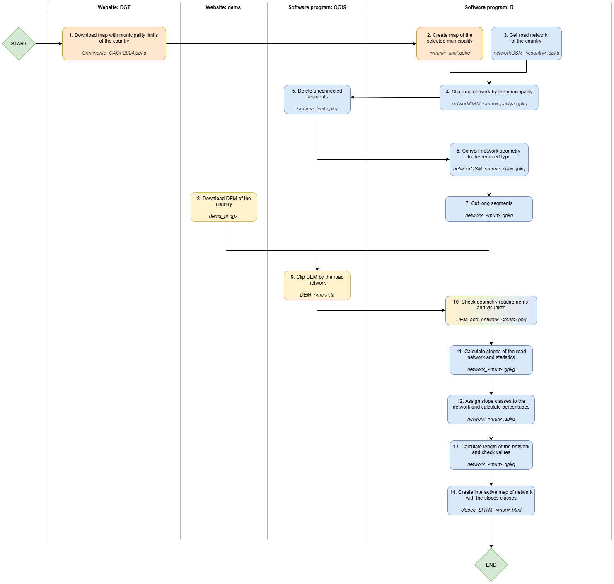
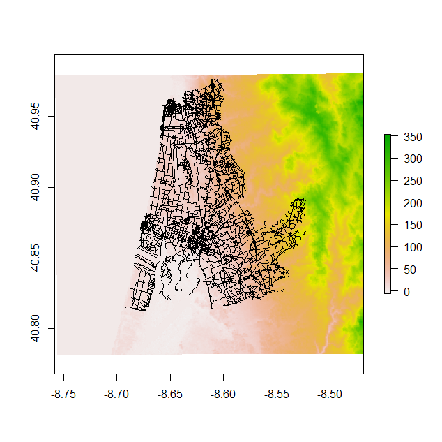

Slopes experiments (WIP)
================

This repo structures and documents the activities in the creation of a map with the slopes of a road network, replicating the rationale, code and most of the instructions in: (https://github.com/U-Shift/Declives-RedeViaria/blob/main/README.md) and adding other relevant information to me to understand the process, successfully create slopes maps and achieve the desired goals.

**Goals**
- check if the road network of a given city is smooth for cycling in terms of slope values
- explore QGIS functionalities
- start learning R language

**References**
- https://github.com/temospena/slopes
- https://docs.ropensci.org/slopes/articles/slopes.html#calculate-slope
- https://github.com/U-Shift/Declives-RedeViaria/blob/main/README.md
- http://www.rosafelix.bike/
- https://r.geocompx.org/spatial-class.html
- https://web.tecnico.ulisboa.pt/rosamfelix/r/COMPILACAO.html#1_scripts_b%C3%A1sicos

**Input map files**
- Digital Elevation Model (DEM) of the country (raster)
- administrative divisions of the country (vector)
- road network of the country (vector)

**Output map files**
- map of slope classes of the road network of a municipality (*html* file):

## Create map of slope classes of a municipality road network

**Process overview**



In this example:
- country: Portugal
- mun: Ovar

### Software requirements
*QGIS*
- Install it by following the instuctions in https://qgis.org/resources/installation-guide/.

*R*
1. Install it by following the instructions in https://cran.r-project.org/.
   For Windows, download the latest version of R from https://cran.r-project.org/bin/windows/base/.
3. Install the required packages by running the following command in R:
    ```
    install.packages("<package_name>")
    ```

    | Package name | Brief description | Source of more information |
    | ------------ | ----------------- | ---------------------------|
    | sf | Simple Features for R; a standardized way to encode and analyze spatial vector data | https://cran.r-project.org/web/packages/sf/index.html |
    | raster | Reading, writing, manipulating, analyzing and modeling of spatial data; superseded by the "terra" package | https://cran.r-project.org/web/packages/raster/index.html |
    | terra | Methods for spatial data analysis with vector and raster data | https://cran.r-project.org/web/packages/terra/index.html ? |
    | geodist | Fast, dependency-free geodesic distance calculations | https://cran.r-project.org/web/packages/geodist/index.html |
    | slopes | Calculates the slope (longitudinal gradient or steepness) of linear geographic features such as roads and rivers | https://cran.r-project.org/web/packages/slopes/index.html |
    | tmap | Thematic maps, that is, geographical maps in which spatial data distributions are visualized | https://cran.r-project.org/web/packages/tmap/index.html |
    | spData | Diverse spatial datasets for demonstrating, benchmarking and teaching spatial data analysis | https://cran.r-project.org/web/packages/spData/index.html ? |

### 1. Download map with municipality limits of the country
Download the most recent CAOP (Carta Administrativa Oficial de Portugal) *`CAOP_Continente_2024_1-gpkg.zip`* by selecting the link https://geo2.dgterritorio.gov.pt/caop/CAOP_Continente_2024_1-gpkg.zip.

### 2. Create map of the selected municipality
1. Unzip the downloaded *geopackage* file *`CAOP_Continente_2024-gpkg.zip`*.
2. Open the R program and load the CAOP file *`Continente_CAOP2024.gpkg`*:
   ```
   CAOP = st_read("<folder_path>/Continente_CAOP2024.gpkg", layer = 'cont_municipios')
   ```
   ```
   ## Reading layer `cont_municipios' from data source `<folder_path>\Continente_CAOP2024.gpkg' using driver `GPKG'
   ## Simple feature collection with 278 features and 9 fields
   ## Geometry type: MULTIPOLYGON
   ## Dimension:     XY
   ## Bounding box:  xmin: -119191.4 ymin: -300404.8 xmax: 162129.1 ymax: 276083.8
   ## Projected CRS: ETRS89 / Portugal TM06
   ```
      
4. Check the names of the columns, particularly the ones of the municipalities and geometry, to be used in the next step:
   ```
   colnames(CAOP)
   ```
   ```
   ## [1] "dtmn"          "municipio"     "distrito_ilha" "nuts3"         "nuts2"         "nuts1"         "area_ha"       "perimetro_km"  "n_freguesias"  "geom"
   ```
   
5. Create geometry with the desired columns:
   ```
   municips_PT = CAOP[,c("municipio","geom")]
   ```
  
6. Change CRS from ETRS89 / Portugal TM06 to WGS84:
   ```
   municips_PT = st_transform(municips_PT, 4326)
   ```

7. Save geometry as geopackage file:
    ```
    st_write(municips_PT, "<path>/Municips_PT.gpkg", append=F)
    ```
    ```
    ## Writing layer `MunicipsPT' to data source `<folder_path>/MunicipsPT.gpkg' using driver `GPKG'
    ## Writing 278 features with 1 fields and geometry type Multi Polygon.
    ```
    Later, to reproduce the exercise for another municipality, skip the steps 1 to 8 and use the file **municips_PT.gpkg** for the next steps.

8. Get the list of the municipalities:
    ```
    municips_PT$municipio
    ```

9. Create map of the desired municipality *`Ovar_limit.gpkg`*:
    ```
    Ovar_limit = municips_PT %>% filter(municipio == "Ovar")
    ```
    

### 3. Get road network of the country
1. In R, call the required libraries and extract file of road network from OSM:
    ```
    library(osmextract)
    library(sf)
    portugal_osm = oe_get("Portugal", provider = "geofabrik", stringsAsFactors = FALSE, quiet = FALSE,
                       force_download = TRUE, force_vectortranslate = TRUE)
    ```
    ```
    ## The input place was matched with: Portugal
    ## Downloading the OSM extract                                                                               File downloaded!
    ## Starting with the vectortranslate operations on the input file!
    ## 0...10...20...30...40...50...60...70...80...90...100 - done.
    ## Finished the vectortranslate operations on the input file!
    ## Reading layer `lines' from data source `/<temp_path>/geofabrik_portugal-latest.gpkg' using driver `GPKG'
    ## Simple feature collection with 1984239 features and 10 fields
    ## Geometry type: LINESTRING
    ## Dimension:     XY
    ## Bounding box:  xmin: -35.65957 ymin: 28.11586 xmax: -2 ymax: 51.28145
    ## Geodetic CRS:  WGS 84
    ```
    The road network of Portugal is downloaded and converted to the *geopackage* format, native format from QIGS, equivalent to shapefile format.

2. Read file and check data, such as Coordinate Reference System and geometry type:
    ```
    networkOSM_PT = st_read("<folder_path>/geofabrik_portugal-latest.gpkg", layer= "lines")
    ```
    ```
    ## Reading layer `lines' from data source `<folder_path>\geofabrik_portugal-latest.gpkg' using driver `GPKG'
    ## Simple feature collection with 1984239 features and 10 fields
    ## Geometry type: LINESTRING
    ## Dimension:     XY
    ## Bounding box:  xmin: -35.65957 ymin: 28.11586 xmax: -2 ymax: 51.28145
    ## Geodetic CRS:  WGS 84

3. Check available categories:
   ```
   table(networkOSM_PT$highway)
   ```
   ```
   ##
   ```
4. Filter roads with the desired categories:
    ```
    library(dplyr)
    networkOSM_PT_filtered = networkOSM_PT %>% 
    dplyr::filter(highway %in% c('primary', "primary_link", 'secondary',"secondary_link", 'tertiary', "tertiary_link",
                "trunk", "trunk_link", "residential", "cycleway", "living_street", "unclassified",
                "motorway", "motorway_link", "pedestrian", "steps", "service", "track"))
    ```
    *Notes from reference instructions:* OpenStreetMap classifies the roads in different categories. The footpaths should be left out of the selected network sample. Also, to get a lighter network, only the higher
    levels roads can be selected, such as the ones with categories "primary", "secondary" and "tertiary". Some roads do not have a category assigned yet but can be used for cycling as well. I kept this category.

5. Save filtered network of the country in geopackage file *`networkOSM_PT_filtered.gpkg`*:
    ```
    st_write(municips_PT, "<path>/networkOSM_PT_filtered.gpkg")
    ```

### 4. Clip road network by the municipality
1. In R, crop the road network to make the next operation lighter, using the municipality limit:
    ```
    #municips_PT = st_read("<path>/MunicipsPT.gpkg")
    library(stplanr)
    linesOSM_mun = st_crop(portugal_osm_filtered, MunLimit)
    ```
    ```
    ## Warning message:
    ## attribute variables are assumed to be spatially constant throughout all geometries
    ```

2. Clip the road network by using a buffer of 100 m, for example, to avoid cutting the lines that are in the limit of the municipality:
    ```
    networkOSM_mun = st_intersection(linesOSM_mun, geo_buffer(mun_limit, dist=100))
    ```
    ```
    ## Warning message:
    ## attribute variables are assumed to be spatially constant throughout all geometries
    ```

3. Save the resulting geometry as *geopackage* file *`networkOSM_Ovar.gpkg`*:
    ```
    st_write(networkOSM_mun, "<folder_path>/networkOSM_Ovar.gpkg")
    ```

### 5. Delete unconnected segments
The segments of the geometry that are isolated, that is, that not connected to the main road network, must be deleted:
1. Load the layer *networkOSM_Ovar.gpkg* in QGIS.
2. In the upper menu, select **Vector** and check if **Disconnected Islands** plugin is displayed.
   - If it is, go to step 3.
   - If not, in the upper menu, select **Plugins** > **Manage and Install Plugins** and check the **Installed** plugins.
       - If **Disconnected Islands** is on the list, tick its box for it to appear on the **Vector** plugins list and go to step 3. (CHECK)
       - If **Disconnected Islands** is not on the list, install it.
           1. Select **Not installed**.
           2. Enter the plugin name name in the search box.
           3. Select it and click **Install Plugin**.
3. In the upper menu, select **Vector**, hover over **Disconnected Islands** and then click Check for **Disconnected Islands**.
4. Select the lowest tolerance and check the option Use all vertices on a road link. 232 segments were selected, with a group ID assigned higher than 0 (networkGRP attribute).
5. Select all the segments with a networkGRP > 0 and invert selection. Then export selection as a new geopackage file as the cleaned network from Ovar: *`networkOSM_Ovar_cleaned.gpkg`*.

### 6. Convert network geometry to the required type
1. Open R and load the cleaned network from Ovar:
    ```
    networkOSM_Ovar_cleaned = st_read("<path>/networkOSM_Ovar_cleaned.gpkg")
    ```
    ```
    ## Reading layer `networkosm_ovar' from data source 
    ## `D:\Documentos\Projetos\GIS\test_slopes3\networkOSM_Ovar_cleaned.gpkg' 
    ##  using driver `GPKG'
    ## Simple feature collection with 6838 features and 12 fields
    ## Geometry type: MULTILINESTRING
    ## Dimension:     XY
    ## Bounding box:  xmin: -8.691657 ymin: 40.81252 xmax: -8.523237 ymax: 40.97621
    ## Geodetic CRS:  WGS 84
    ```
    After the previous operation, geometry type is now MULTILINESTRING.
   
3. Convert the geometry type to `LINSTRING` - the required geometry type for the slopes calculation:
    ```
    networkOSM_Ovar_conv = portugal_osm_filtered %>% filter(osm_id %in% networkOSM_Ovar_cleaned$osm_id)
    ```
4. Check if geometry type is now correct:
    ```
    st_geometry(networkOSM_Ovar_cov)
    ```
    ```
    ## Geometry set for 6838 features 
    ## Geometry type: LINESTRING
    ## Dimension:     XY
    ## Bounding box:  xmin: -8.691792 ymin: 40.78936 xmax: -8.509474 ymax: 40.98472
    ## Geodetic CRS:  WGS 84
    ## First 5 geometries:
    ## LINESTRING (-8.610939 40.92746, -8.610506 40.92...
    ## LINESTRING (-8.602149 40.93018, -8.602284 40.92...
    ## LINESTRING (-8.60018 40.9277, -8.60056 40.92781...
    ## LINESTRING (-8.603908 40.92804, -8.6037 40.9279...
    ## LINESTRING (-8.60317 40.92573, -8.602993 40.925...
    ```
5. Save converted geometry in geopackage file *`networkOSM_Ovar_conv.gpkg`*:
    ```
    st_write(networkOSM_Ovar_conv, "<path>/networkOSM_Ovar_conv.gpkg")
    ```
    
### 7. Cut long segments
The goal is to cut long segments to calculate a mean value that is more realistic. Road segments will be cut at the instersection with another segments that have the same z level, to avoid cutting brunels. EXPLAIN
1. In R, check the number of rows of the road network layer:
    ```
    nrow(networkOSM_Ovar_cleaned)
    ```
    ```
    ## [1] 6838
    ```
2. Use a function that cut the segments in its internal vertices except in the intersection with brunels (bridges and tunnels):
    ```
    library(stplanr)
    network_Ovar = stplanr::rnet_breakup_vertices(networkOSM_Ovar_cleaned)
    ```
3. Check the number of rows after cutting the road network in the intersections:
    ```
    nrow(network_Ovar)
    ```
    ```
    ## [1] 11772
    ```
4. Export the resulting geometry to *geopackage* format *`network_Ovar.gpkg`*:
   
    ```
    st_write(network_Ovar, "D:/Documentos/Projetos/GIS/test_slopes3/network_Ovar.gpkg")
    ```
    The road network is ready for the slopes calculation.

### 8. Download DEM of the country
Download the QGIS project with DEM layer from https://www.fc.up.pt/pessoas/jagoncal/dems/ by using the link https://www.fc.up.pt/pessoas/jagoncal/dems/dems_pt.zip.

### 9. Clip DEM by the road network
Since the raster covers the country but only a small area is needed, cut the DEM raster to the city netowrk for the slopes analysis.

1. After unzipping the downloaded file, double-click in *`dems_pt.qgz`* to open it in QGIS.
2. Choose the desired DEM (I selected STRM).
3. In the upper menu, select **Raster** > **Extraction** > **Clip Raster by Extent**.
4. In the **Raster Extraction - Clip Raster by Extent** window, select the parameters:
    - **Input layer**: select DEM file from the dropdown list
    - **Clipping extent**: select **Draw on Map Canvas** from the dropdown list and draw the rectangle of the desired extent
5. Click **Run**. The clipped raster layer is created.
6. Select the clipped DEM layer and right-click it.
7. Hove over **Export** and select **Save as** from the menu.
8. In the **Save raster layer as** window, select **GeoTIFF** from the **Format** drop-down list.
9. In the **Filename** box, enter the name of the file (I chose the name *DEM_Ovar*.) You can click the side button **Navigate** to choose the folder and alterantively enter the name in the pop-up window.
10. Click **OK**. File with name *`DEM_Ovar.tif`* is created. \
*NOTE:* The default CRS WGS84 can be selected in the **CRS** field so that the DEM raster is in the same Coordinate Reference System as the one of the road network. This will be important in section [6. Calculate slopes](#calculate-slopes).

### 10. Check geometry requirements and visualize
The DEM and road network geometries - *`DEM_Ovar.tif`* and *`network_Ovar.gpkg`* - must be in the same CRS:
1. Load the clipped DEM in R:
    ```
    st_read("<folder_path>/DEM_Ovar.gpkg")
    ```
    
3. Plot DEM and road network of Ovar together:
    ```
    raster::plot(DEM_Ovar)
    plot(sf::st_geometry(network_Ovar), add = TRUE)
    ```



### 11. Calculate slopes of the road network and statistics
1. Still in R, add a column to the road network with the slopes values:
    ```
    network_Ovar$slope = slope_raster(network_Ovar, dem = DEM_Ovar )
    ```
   
3. Calculate the percentage of the following slopes values: minimum, P25, median, average, P75, maximum:
    ```
    network_Ovar$slope_perc = network_Ovar$slope*100
    summary(network_Ovar$slope_perc)
    ```
    ```
    # Min. 1st Qu.  Median    Mean 3rd Qu.    Max. 
    # 0.000   1.401   2.546   3.023   3.987  18.496
    ``` 

### 12. Assign slope classes to the network and calculate percentages
1. Create a new column for slope classes and assign a value for each road:
    ```
    network_Ovar$slope_class =  network_Ovar$slope_perc %>%
       cut(
         breaks = c(0, 3, 5, 8, 10, 20, Inf),
         labels = c("0-3: flat", "3-5: light","5-8: medium", "8-10: hard", "10-20: terrible", ">20: impossible"),
         right = F
       )
    ```

2. Calculate the percentage of roads of each slope class:
    ```
    round(prop.table(table(network_Ovar$slope_class))*100,1)
    ```
    ```
    ##      0-3: flat       3-5: light      5-8: medium  8-10: hard 10-20: terrible >20: impossible
    ##           58.4            25.1            13.2             1.3             2.0             0.0 COPY AND PASTE AGAIN
    ``` 
    This means that half of the streets of the sample are flat or almost flat, and more than 80% of the streets are perfectly cyclable.

### 13. Calculate length of the network and check values
1. Add a column with the length of each segment of the geometry in meters:
    ```
    network_OSM$length = st_length(network_OSM)
    ```
2. Check the new columns and some values:
    ```
    head(ovar_route3)
    ```

### 14. Create interactive map of network with the slope classes
1. Prepare data for visualization by creating a colour palette between dark green and dark red:
    ```
    palredgreen = c("#267300", "#70A800", "#FFAA00", "#E60000", "#A80000", "#730000")
    ```
2. Load library and set tmap mode to "view":
    ```
    library(tmap)
    tmap_mode("view")
    ```
    ```
    ## tmap mode set to "view".
    ```
3. Create map of slope classes:
    ```
    tmap_options(basemaps = leaflet::providers$CartoDB.Positron) #base map
    ```
    ```
    ## [v3->v4] `tmap_options()`: use basemap.server instead of basemaps
    ```
    ````
    tmap_options(basemap.server = leaflet::providers$CartoDB.Positron)
    map_slopes =
     tm_shape(network_Ovar) +
     tm_lines(
         col = "slope_class",
         palette = palredgreen, #colours palette
         lwd = 2, #thickness of lines
         title.col = "Slope [%]",
         popup.vars = c("Type: " = "highway",
                        "Length" = "length",
                        "Slope: " = "slope",
                        "Class: " = "slope_class"),
         popup.format = list(digits = 1),
         # id = "slope"
         id = "name" #if the PC is not able to export due lack of memory, delete this line
       )
    ```

4. Save created map as *html* file *`slopes_SRTM_Ovar.html`*:
    ```
    tmap_save(map_slopes, "<folder_path>/slopes_SRTM_Ovar.html")
    ```

    
